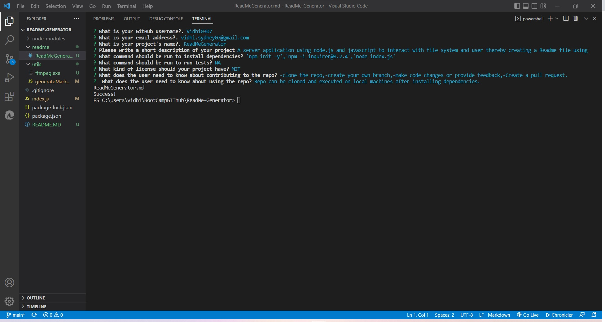

# < ReadMe generator  >

## Description

This project is the solution for the Bootcamp week 9 Challenge .The objective was to append the existing code to implement a server application using node.js which on execution will prompt questions to the users and use the given answers for creating a readme file.
-I have tried my best to implement the code using the node.js and npm knowledge.-I am happy that I was able to actually apply the skills, it gave me more clarity and confidence about the knowledge.

## Installation
-A video of code execution is recorded in vs studio has been created and uploaded to youtube.:

-Github code can be cloned and dependencies can be installed 'npm init -y' and npm i 'inquirer@8.2.4' and code can be executed on your local machines.

## Usage

Project can be used to see how the inbuit file system (fs) module can be used to create and append files ,also how external modules can be imported using(requirer) and used within a project.

## Mock-Up

The following image shows the web application's appearance and functionality:

## Credits

https://www.w3schools.com/nodejs/default.asp

https://stackoverflow.com/

https://www.educative.io/answers/how-to-use-the-inquirer-node-package

https://www.youtube.com/watch?v=TlB_eWDSMt4

## License

Not applicable

## Features

A repo has been created which consists all the code :
https://github.com/Vidhi0307/ReadMe-Generator

Video LINK : https://youtu.be/7yEoiv_DUEg